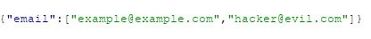

# OTB-Techniques
*Outside-The-Box Techniques for Bug Bounties 2020 by TheWestonGuy*

* If you either see an "***application/json***" or "***application/x-www-form-urlencoded***" **POST** request, try changing the parameters to **arrays**, especially on user modification pages like **forgot password** pages.
***EXAMPLE***:

* Try changing **POST request** parameter values to **decimals**, if they are **numbers**.
